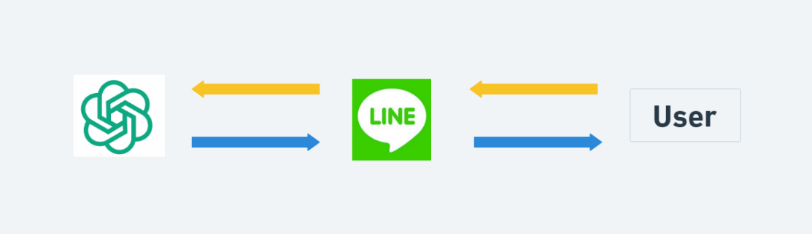
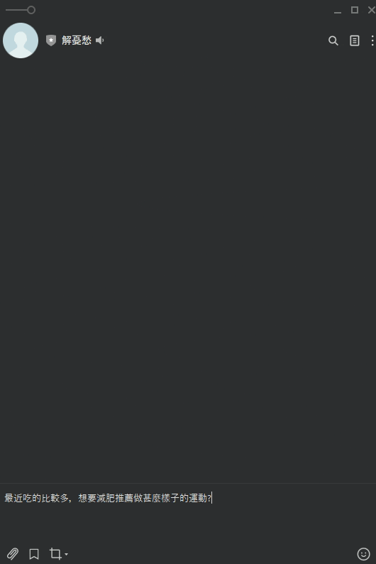

## Introduce

Users can create their own LINE BOT through this program. Hope you have a pleasant experience!

This website is built with Node.js, Express.js, LINE API, OPENAI API.

## Architecture Diagram







## Features

- OPENAI API
- Line API

 
## Installing

1.Clone the repository
```
git clone https://github.com/TheyCallMeAndyBro/Line_Bot.git
```

2.Move to file
```
cd Line_Bot
```

3.Install npm packages
```
npm install
```

4.Set your LINE API / OPENAI API
```
reference .env.example
```

5.Start
```
npm start
```

6..Stop
```
ctrl +　ｃ
```
